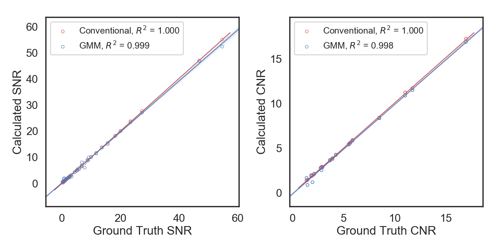

********
Examples
********

Test case
---------

A test image is included in the examples directory called "test.tif". This image has three materials - air, tissue, and wax, so three Gaussian components should be fitted to this image.

Phantom validation
------------------

A Jupyter notebook going through a validation test to assess the accuracy of the Gaussian mixture model fitting is provided under Phantom_Validation.ipynb.

Benchmarking tests
------------------

The performance of the GMM image quality tool and conventional SNR and CNR calculation by user-defined regions-of-interest was compared against ground truth values from phantom images with known SNR and CNR. Phantom images were created by replacing pixels from each material within a three-material image with random values from Gaussian distributions with known means and standard deviations. The SNR and CNR were varied by multiplying the standard deviations by a factor of 0.25 to 3 depending on the desired image quality level. 

The script to generate phantom images and assess its performance is included as examples/benchmarking.py, and an ImageJ macro which was used to calculate SNR and CNR conventionally has been included as Conventional_SNR_CNR.ijm.

SNR and CNR calculated by GMM and conventional methods were found to be comparable to ground truth values (R\ :sup:`2` value > 0.99). However, GMM calculations were 60x faster (1 second/phantom image) than conventional calculations (1 min/phantom image). 

